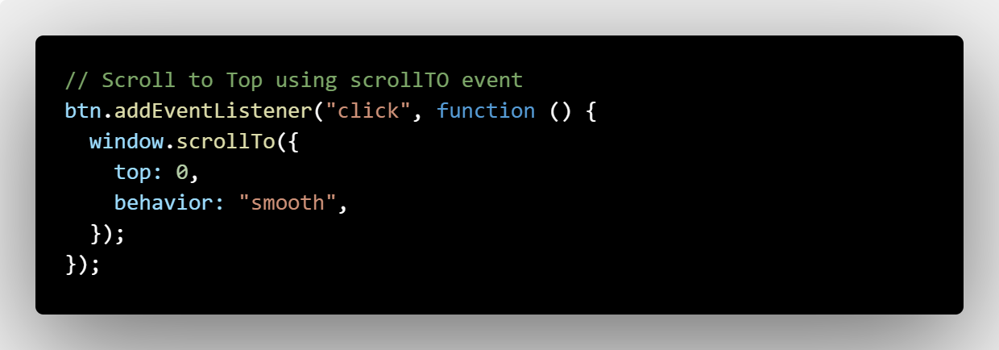

# Landing Page Project

---

### Description Of Project

- Name : Landing Page Project
- Description : Build Landing page that uses JavaScript to create an interactive navigational for the user
- Technologies :
  - HTML
  - CSS
  - JavaScript

> I downloaded this from udacity and made some Changes on HTML & CSS files

### Details

1. **HTML file**
   - I added a new section to meet requirements
   - Linked JavaScript page to HTML page
   - added button to make scroll To top function
2. **CSS file**

   - I added a style to active-link in nevbar
   - Added style to scroll to top button
   - changed some colors like hover color

3. **JavaScript file**
   - According to the comments that were written I added the JavaScript code under each of them
   - defined the global variables that I will need the most under Define Global Variables comment
   - I wrote the functions that will be passed under the Helper Functions comment
   - I wrote the main functions that play the main role under Main Functions comment
   - I wrote the events that will be needed under events comment
     > but there are some events I found their comments on main functions comment so I wrote them there

### How I Made The Work Done

- I made some researches on the providing requests and the assest functions to make my Project meet the requirements
- Researches are from (MDN - W3School and Youtube)
- I wrote comments before every function to determinine their actions

### Requirements

- [x] Styling should be added for active states.
      
- [x] Set CSS class active state when the element is in the viewport.
- [x] It should be clear which section is being viewed while scrolling through the page.
      
- [x] When clicking an item from the navigation menu, the link should scroll to the appropriate section
      
- [x] The active section in the Navbar should be highlighted.
      
- [x] There are at least 4 sections that have been added to the page
      
- [x] Navigation is built dynamically as an unordered list
      

### Additional Tasks

- [x] Add an active state to your navigation items when a section is in the viewport
      
- [x] Hide fixed navigation bar while not scrolling
      
- [x] Add a scroll to top button on the page that’s only visible when the user scrolls below the fold of the page
      

  >              I hope I will meet the requirements. Thanks.
